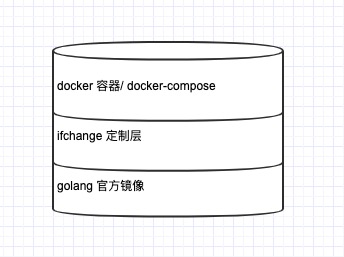

# Go 开发/运行环境
* go 环境的镜像构建

## 镜像
### Go 官方版
* 基于明确的语义版本 `1.14.3`
    `docker pull golang:1.14.3-buster`
* 简单地启动一个测试容器：`docker run --name go1 --rm -it golang:1.14.3-buster bash`

### Go 定制版
* `docker build -t docker_go:0.1.0 .`
    * 测试运行 `docker run --name e_go1 --rm -it docker_go:0.1.0 bash`

### 使用
* 在当前目录下，使用 docker-compose 启动（推荐）：`docker-compose up --build -d`

## 附录
### 镜像构建层级概览



### 镜像 tags 意义
* `alpine` 就是精简版，而 `buster`,`stretch`,`jessie` 是基于 Debian 套件发行版的代码版本名称来命名。
* Debian 是另一个 Linux 系统发行版，类似于 Ubuntu

```
Debian 10（buster） — 当前的稳定版（stable）
Debian 9（stretch） — 旧的稳定版（oldstable）
Debian 8（jessie） — 更旧的稳定版（oldoldstable）
Debian 7（wheezy） — 被淘汰的稳定版
```

### 拉取镜像慢
* 可以使用国内镜像源 https://www.cnblogs.com/zhangrui153169/p/12699077.html

## 规范
* 使用 gofmt 程序对代码进行格式化，保证格式统一

### 设计相关
* 有针对性地对目前 PHP 系统中的痛点进行设计，避免之前 PHP 中遇到的问题：
    * 单点问题
    * 日志问题
    * 代码风格，使用 `gofmt`(https://gocn.vip/wiki/effective) 解决
    * debug，使用 [delve](https://github.com/go-delve/delve) 解决，可用它进行[命令行调试](https://davidlovezoe.wordpress.com/2019/01/24/ golang-debug-intermediate/) 以及远程调试

## 参考
* 镜像名称的意义 https://segmentfault.com/q/1010000021722055
* docker-compose file https://docs.docker.com/compose/compose-file/
* go 模块代理 https://goproxy.cn/
* 5分钟用Docker搭建开发环境 https://cloud.tencent.com/developer/article/1584875
* go 开发调试3篇 https://gocn.vip/topics/9197
